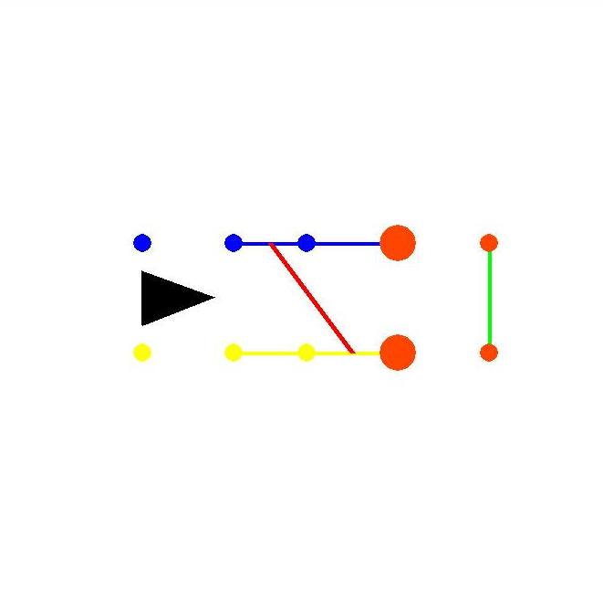

# fsdviewer

simple 2d viewer for formula student driverless software

This simple library was written to help the development of algorithms(slam and path planning).
The idea is simple, you can add one function to your main loop, pass a list of what you want to draw and thats it.



## Features 

- Draw cones(circles) in multiple colors and sizes
- Draw Multiple Cars
- Draw lines between cones
- Draw lines between lines
- Move and zoom in and out


## Tutorial
Install via pip
```bash
pip3 install fsd-viewer-jpvolt
```

Import the library
```python
from fsdviewer import viewer2d # import viewer
from fsdviewer.viewer2d import Car, Cone, Line, LineMiddle # import drawable objects
```

Create 4 lists, one for each drawable object type
```python
conesList = []
linesList = []
middleLineList = []
carList = []
```
update the lists with what you want to draw
```python
### your code 
coneList.append(Cone(color='red', x=10, y=10, size=5))
```
Add draw call to your main loop
```python
### your code ...
while(true): ### your main loop
    viewer2d.draw(conesList, linesList, middleLineList, carList)

```

And that´s it.

### Creating drawable objects

#### Cones
```python
cone = Cone(color='blue', x=10, y=10, size=5))
```
x, y and size are in pixels units
Avaliable cone colors:
- 'blue'
- 'yellow'
- 'orange'
- 'green'
- 'black'

#### Lines
Lines creates lines bettween cones
```python
line = Line(cone1=0, cone1=2, color='red',  size=5))
```
cone1 and cone2 are cones index in cone lists
Avaliable line colors:
- 'red'
- 'blue'
- 'yellow'
- 'orange'
- 'green'

#### MiddleLines
MiddleLine creates a line bettween lines
```python
mline = MiddleLine(cone1=0, cone2=1,cone3=3, cone4=4 color='red',  size=5))
```
cone1, cone2, cone3, cone4 are cones index on cone list to be connected with line
Avaliable line colors:
- 'red'
- 'blue'
- 'yellow'
- 'orange'
- 'green'


#### Cars
```python
car = Car(x=10, y=10, rot=0.5, color='black')
```
x, y are in pixels
rot is the rotation of the car, in radians
Avaliable car colors:
- 'blue'
- 'green'
- 'blue'